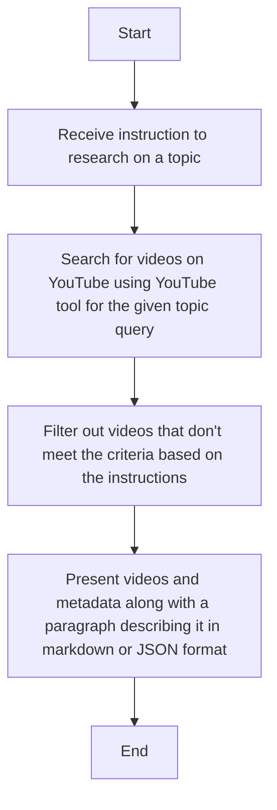

# Flow of Research Agent

Youtube Research Agent does the following given an instruction to research on a topic:

- Searches for videos on youtbube using Youtube tool for a given topic query
- Based on the instructions, it filter out the videos that don't meet the criteria
- Present videos and meta data along with a paragraph describing it in a markdown or json format

## Flow

